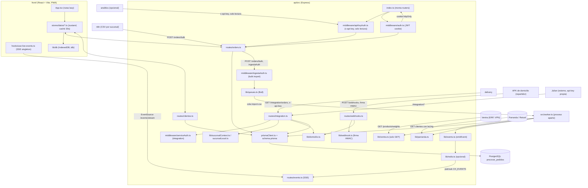

# Mapa interno de PEDIDO

PEDIDO gestiona los pedidos, clientes y vendedores de las 8 sucursales de
Procovar: quién levanta un pedido, a qué cliente, con qué productos y en qué
estado está. Es el **origen de la verdad** de esas tres entidades — el resto de
proyectos de Procovar (delivery, analitics, integraciones externas) leen de
aquí, nunca al revés. Resuelve el problema de tener 8 puntos de venta
funcionando con enlaces lentos e intermitentes (CGNAT de Starlink, VPN al
almacén) sin perder pedidos ni ver datos de otra sucursal.

## Diagrama

## Piezas

| Pieza | Dónde vive | De qué se ocupa |
|---|---|---|
| `api/src/index.ts` | api | Monta Express: CORS, cookies, multer, orden de middlewares y de los 15 routers |
| `api/src/routes/orders.ts` | api | Pedidos: CRUD, `/bulk` (import CSV), `processBulkImport` (compartido con el worker) |
| `api/src/routes/integration.ts` | api | Lectura/escritura para **delivery**: clientes geolocalizados, costo de domicilio |
| `api/src/routes/webhooks.ts` | api | Entrada de la APK de domicilio: firma HMAC, sin sesión |
| `api/src/routes/events.ts` | api | SSE genérico (`/events/stream`), ticket efímero por sucursal |
| `api/src/routes/clientes.ts` | api | Clientes; dispara el sync con Parranda (`/sync-parranda`) |
| `api/src/worker.ts` | api, proceso aparte (`node dist/worker.js`) | Cola de import CSV, sondeo de Ventra, sync de Parranda, cotejo de facturación, tasa de cambio |
| `api/src/lib/sucursalContext.ts` / `sucursalLocal.ts` | api | Resuelve a qué sucursal pertenece cada petición; lee `config.json` |
| `api/src/lib/ventra.ts` | api | Cliente **solo lectura** del ERP Ventra (precios, existencias, peso) |
| `api/src/lib/parranda.ts` | api | Cliente de Parranda/Retool: enriquece clientes con lat/lng, no crea clientes |
| `api/src/lib/domicilio.ts` | api | Aplica el costo de domicilio que devuelve delivery a un pedido |
| `api/src/lib/webhook.ts` | api | Config y verificación de firma de los webhooks entrantes |
| `api/src/lib/redis.ts` / `queues.ts` | api | Cliente Redis opcional (Sentinel-ready) + colas Bull; SSE cae a polling sin él |
| `api/prisma/schema.prisma` | api | 14 modelos: Sucursal, Usuario, Vendedor, Pedido, PedidoItem, Cliente, ApiKey, WebhookConfig… |
| `front/src/App.tsx` | front | Rutas (lazy por página) y control de acceso por rol |
| `front/src/stores/datos/*.ts` + `crearStoreDatos.ts` | front | Caché zustand por entidad (30s fresco), aplica eventos SSE en sitio sin refetch |
| `front/src/hooks/use-live-events.ts` | front | Una sola conexión SSE por pestaña, reparte eventos a los stores |
| `front/src/lib/db` | front | IndexedDB (idb) para modo offline/PWA |
| `front/src/lib/sync` | front | Pull/push contra `/sync/pull` — **no hay tal ruta en el api actual**; parece código muerto o de una integración aún no montada |

## Fronteras — con qué habla fuera

- **PostgreSQL** (`procovar_pedidos`) — vía Prisma (`api/src/prismaClient.ts`), único punto de escritura/lectura de datos.
- **Redis** — opcional (`REDIS_URL`), dos usos: pub/sub de eventos SSE (`CH_EVENTS`) y cola Bull de import CSV (`procovar-pedido:import-csv`). Sin él, SSE hace polling e import se procesa dentro del request.
- **Ventra (ERP del almacén)** — `api/src/lib/ventra.ts`, solo `GET /products/weights?database=<sucursal>`, alcanzable solo por VPN WireGuard interna. Si la VPN no contesta, falla en silencio y se queda con la última foto de precios buena.
- **Parranda (Retool)** — `api/src/lib/parranda.ts`, trae clientes con geolocalización directa; solo enriquece, nunca crea clientes.
- **delivery** — consume `/integration/*` con `x-api-key` (middleware `serviceAuth`): lee pedidos pendientes de domicilio y clientes geolocalizados, y escribe de vuelta `Pedido.costoDomicilio`.
- **APK de domicilio (repartidor)** — entra por `POST /webhooks/*`, autenticada por firma HMAC con secret propio (rotable desde Configuración), no por api-key.
- **n8n** — sube los CSV de ventas de cada sucursal a `POST /orders/bulk`, protegido por `ingestaAuth` (sesión, api-key de servicio, o llamada directa entre contenedores sin pasar por Traefik).
- **Julian (externo)** y **analitics** — consumen `/integration/*` o endpoints de lectura con su propia `x-api-key`; analitics es opcional, si no está configurado esa columna del front no aparece.
- **config.json** (`sucursalId`) — no es una frontera de red pero decide el alcance: `null` = ve todo (central), un id = se acota a esa sucursal en `/integration/*`. Un id mal puesto vacía el espejo de clientes de delivery (ya pasó).

## Por dónde entrar

1. **`QUE-ES.md`** (raíz) — resumen de una página de qué es, quién lo consume y de qué depende; es el mapa antes del mapa.
2. **`api/src/index.ts`** — el orden real de middlewares y routers dice cómo se autentica cada tipo de llamada (sesión, api-key, service-key, firma) antes de tocar una sola ruta.
3. **`api/prisma/schema.prisma`** — los 14 modelos y sus relaciones son el vocabulario real del dominio; sin esto los nombres de las rutas no dicen nada.
4. **`api/src/worker.ts`** — separa lo que es petición HTTP de lo que es trabajo de fondo (import CSV, sondeo a Ventra, sync con Parranda); confundir esto lleva a buscar código donde no está.
5. **`front/src/App.tsx`** — quién puede ver cada pantalla (roles por sucursal) y qué se carga de entrada frente a qué se carga bajo demanda.
